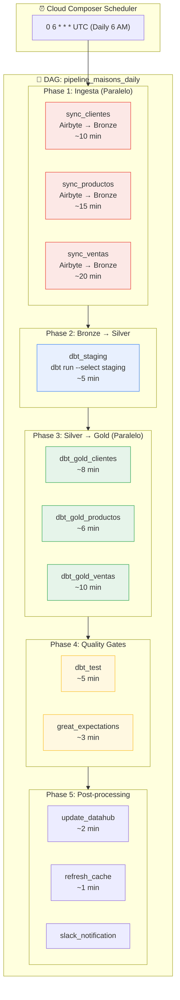
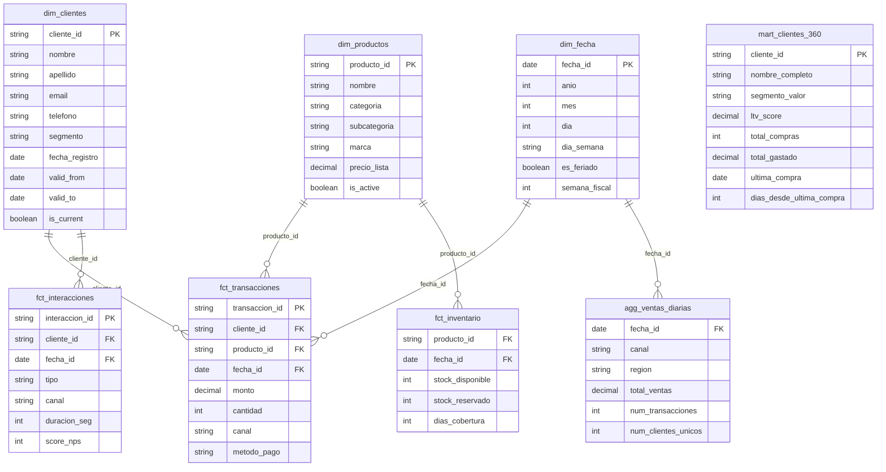

# Documento de Arquitectura Técnica
## Data Mesh Platform - Especificación de Diseño

**Cliente:** Orbidi  
**Fecha:** Diciembre 2025
**Versión:** 2.0  
**Audiencia:** CTO, Data Engineering, Data Architecture

---

## Tabla de Contenidos

1. [Resumen Técnico](#1-resumen-técnico)
2. [Arquitectura de Alto Nivel](#2-arquitectura-de-alto-nivel)
3. [Stack Tecnológico y ADRs](#3-stack-tecnológico-y-adrs)
4. [Arquitectura Medallion](#4-arquitectura-medallion)
5. [Diseño de Pipelines](#5-diseño-de-pipelines)
6. [Modelo de Datos](#6-modelo-de-datos)
7. [Gobernanza y Seguridad](#7-gobernanza-y-seguridad)
8. [Observabilidad](#8-observabilidad)
9. [Infrastructure as Code](#9-infrastructure-as-code)
10. [Estrategia de Testing](#10-estrategia-de-testing)
11. [Performance y Escalabilidad](#11-performance-y-escalabilidad)
12. [Estimación de Costos Detallada](#12-estimación-de-costos-detallada)
13. [Riesgos y Mitigaciones](#13-riesgos-y-mitigaciones)
14. [Roadmap de Implementación](#14-roadmap-de-implementación)

---

## 1. Resumen Técnico

### 1.1 Objetivos de Arquitectura

| Objetivo | Métrica de Éxito | Prioridad |
|----------|------------------|-----------|
| **Latencia de datos** | Datos en Gold < 4 horas desde origen | P0 |
| **Disponibilidad** | 99.9% uptime para capa Gold | P0 |
| **Escalabilidad** | Soportar 10x crecimiento sin rediseño | P1 |
| **Time-to-insight** | Nueva fuente productiva en < 5 días | P1 |
| **Costo por TB** | < $50/TB/mes (storage + compute) | P2 |

### 1.2 Principios de Diseño

1. **Immutability en Bronze:** Los datos crudos nunca se modifican, solo se agregan
2. **Idempotencia:** Todos los pipelines pueden re-ejecutarse sin efectos secundarios
3. **Separation of Concerns:** Cada capa tiene una única responsabilidad
4. **Schema-on-Read en Bronze, Schema-on-Write en Gold**
5. **Fail-Fast:** Detectar errores lo antes posible en el pipeline

### 1.3 Constraints Técnicos

- **Cloud Provider:** Google Cloud Platform (requisito contractual)
- **Open-Source Priority:** Minimizar vendor lock-in donde sea posible
- **Compliance:** GDPR-ready, datos PII identificados y protegidos
- **Budget:** Optimizar para volumen actual con capacidad de escalar

---

## 2. Arquitectura de Alto Nivel

### 2.1 Diagrama de Arquitectura Completo


### 2.2 Flujo de Datos End-to-End

```
┌──────────┐    ┌──────────┐    ┌──────────┐    ┌──────────┐    ┌──────────┐    ┌──────────┐
│  Source  │───▶│  Airbyte │───▶│   GCS    │───▶│  Bronze  │───▶│  Silver  │───▶│   Gold   │
│          │    │  (E&L)   │    │  (Lake)  │    │  (Raw)   │    │ (Clean)  │    │ (Marts)  │
└──────────┘    └──────────┘    └──────────┘    └──────────┘    └──────────┘    └──────────┘
     │               │               │               │               │               │
     │          CDC/API         Parquet          BigQuery        BigQuery        BigQuery
     │          Incremental     Partitioned      Append-only     Incremental     Materialized
     │                                                                               │
     └───────────────────────────────────────────────────────────────────────────────┘
                                    Lineage tracked in DataHub
```

---

## 3. Stack Tecnológico y ADRs

### 3.1 Matriz de Tecnologías

| Capa | Componente | Tecnología | Licencia | Alternativa Descartada | Justificación |
|------|------------|------------|----------|------------------------|---------------|
| Ingesta | EL Tool | Airbyte OSS | MIT | Fivetran, Stitch | Open-source, sin costo por MAR |
| Orquestación | Workflow | Cloud Composer | Apache 2.0* | Airflow self-managed | Managed service, HA incluido |
| Transformación | ELT | dbt Core | Apache 2.0 | Dataform | Más maduro, mejor comunidad |
| Warehouse | OLAP | BigQuery | Propietario | ClickHouse, Snowflake | Requisito GCP, mejor integración |
| Catálogo | Metadata | DataHub | Apache 2.0 | Data Catalog | Linaje automático, extensible |
| Calidad | Testing | Great Expectations | Apache 2.0 | Soda, Monte Carlo | Open-source, integración dbt |
| BI | Dashboards | Apache Superset | Apache 2.0 | Looker, Tableau | Open-source, SQL-native |
| ML | Platform | Vertex AI | Propietario | MLflow + Kubeflow | Integración nativa GCP |
| IaC | Provisioning | Terraform | MPL 2.0 | Pulumi, CloudFormation | Estándar industria, multi-cloud |

*Cloud Composer es Airflow gestionado, el código de DAGs es 100% portable.

### 3.2 Architecture Decision Records (ADRs)

#### ADR-001: Airbyte sobre Fivetran para Ingesta

**Contexto:** Necesitamos una herramienta de Extract-Load con conectores para PostgreSQL, MySQL, MongoDB, SAP, Salesforce y SurveyMonkey.

**Decisión:** Airbyte OSS desplegado en GKE.

**Análisis:**

| Criterio | Airbyte | Fivetran | Peso |
|----------|---------|----------|------|
| Licencia | MIT (Open-source) ✅ | Propietario ❌ | 30% |
| Conectores | 300+ ✅ | 150+ ✅ | 20% |
| Costo | Infra only (~$300/mo) ✅ | $1-2/MAR ❌ | 25% |
| Extensibilidad | Connector Builder ✅ | Limited ❌ | 15% |
| Ops overhead | Alto ⚠️ | Bajo ✅ | 10% |

**Consecuencias:**
- (+) Cumple requisito open-source
- (+) Control total sobre sincronizaciones
- (+) Sin costo por volumen de datos
- (-) Mayor carga operacional (mitigación: runbooks, alertas)
- (-) Requiere GKE cluster dedicado

**Trade-off aceptado:** Overhead operacional a cambio de flexibilidad y costo predecible.

---

#### ADR-002: Cloud Composer sobre Airflow Self-Managed

**Contexto:** Necesitamos orquestación de pipelines con dependencias complejas.

**Decisión:** Cloud Composer 2 (Airflow managed).

**Análisis:**

| Criterio | Composer | Self-managed | Peso |
|----------|----------|--------------|------|
| Ops overhead | Bajo ✅ | Alto ❌ | 35% |
| Escalabilidad | Auto-scaling ✅ | Manual ⚠️ | 25% |
| Integración GCP | Nativa ✅ | Configuración ⚠️ | 20% |
| Portabilidad | DAGs portables ✅ | DAGs portables ✅ | 10% |
| Costo | ~$400/mo ⚠️ | ~$200/mo ✅ | 10% |

**Consecuencias:**
- (+) HA y auto-scaling incluido
- (+) Integración nativa con IAM, GCS, BigQuery
- (+) Actualizaciones de seguridad gestionadas
- (-) Costo fijo mayor
- (-) Menos control sobre versiones de Airflow

**Nota:** Los DAGs son 100% compatibles con Airflow OSS. Si se requiere migrar, el código es portable.

---

#### ADR-003: Arquitectura Medallion (Bronze/Silver/Gold)

**Contexto:** Necesitamos estructurar el data warehouse para soportar trazabilidad, reprocesamiento y diferentes niveles de acceso.

**Decisión:** Implementar arquitectura Medallion con 3 capas.

**Diagrama de responsabilidades:**

```
┌─────────────────────────────────────────────────────────────────────────────┐
│                           ARQUITECTURA MEDALLION                            │
├─────────────┬─────────────────────────────────────────┬─────────────────────┤
│    CAPA     │            RESPONSABILIDAD              │       OWNER         │
├─────────────┼─────────────────────────────────────────┼─────────────────────┤
│   Bronze    │ • Almacenar datos crudos (1:1 fuente)   │ Data Engineering    │
│             │ • Preservar historial completo          │                     │
│             │ • Schema-on-read                        │                     │
├─────────────┼─────────────────────────────────────────┼─────────────────────┤
│   Silver    │ • Limpieza y deduplicación              │ Data Engineering    │
│             │ • Tipado y validación                   │                     │
│             │ • Modelos intermedios compartidos       │                     │
├─────────────┼─────────────────────────────────────────┼─────────────────────┤
│   Gold      │ • Marts de negocio                      │ Domain Teams        │
│             │ • KPIs y agregaciones                   │                     │
│             │ • Optimizado para consumo               │                     │
└─────────────┴─────────────────────────────────────────┴─────────────────────┘
```

**Consecuencias:**
- (+) Reprocesamiento desde Bronze si hay bugs
- (+) Debug simplificado (trazar Gold → Silver → Bronze)
- (+) Control de acceso por capa
- (-) Mayor almacenamiento (~2.1x datos originales)
- (-) Latencia adicional por transformaciones

**Justificación de costo:**

| Capa | % del total | Costo 100GB/mes |
|------|-------------|-----------------|
| Bronze | 48% | $2.00 |
| Silver | 38% | $1.60 |
| Gold | 14% | $0.60 |
| **Total** | 100% | **$4.20** |

El costo de storage es marginal ($0.02/GB/mes). El beneficio de trazabilidad justifica la duplicación.

---

#### ADR-004: DataHub sobre Google Data Catalog

**Contexto:** Necesitamos catalogación de datos con linaje automático.

**Decisión:** DataHub OSS desplegado en GKE.

**Comparación:**

| Feature | DataHub | Data Catalog |
|---------|---------|--------------|
| Licencia | Apache 2.0 ✅ | Propietario ❌ |
| Linaje dbt | Nativo (manifest.json) ✅ | Manual ❌ |
| API | GraphQL extensible ✅ | REST limitado ⚠️ |
| UI | Moderna, búsqueda avanzada ✅ | Básica ⚠️ |
| Custom metadata | Aspectos personalizables ✅ | Tags simples ⚠️ |

**Consecuencias:**
- (+) Linaje end-to-end automático
- (+) Integración con dbt, Airflow, BigQuery
- (-) Requiere despliegue y mantenimiento

---

#### ADR-005: Datasets Gold Separados por Entidad

**Contexto:** Los marts de negocio deben servir a diferentes equipos con diferentes permisos.

**Decisión:** Crear un dataset BigQuery por entidad de negocio (`gold_clientes`, `gold_productos`, `gold_ventas`).

**Alternativas consideradas:**

| Opción | Pros | Cons |
|--------|------|------|
| Un solo dataset Gold | Simple | Sin granularidad de permisos |
| Un dataset por tabla | Muy granular | Demasiados datasets |
| **Un dataset por entidad** | Balance permisos/simplicidad ✅ | Más datasets que opción 1 |

**Consecuencias:**
- (+) Equipo de ventas solo ve `gold_ventas`
- (+) Billing granular por área de negocio
- (+) Quotas independientes por dataset
- (-) Cross-domain queries requieren permisos explícitos

---

## 4. Arquitectura Medallion

### 4.1 Estructura de Datasets en BigQuery

```
📁 Proyecto GCP: maisons-data-platform
│
├── 🥉 Dataset: bronze
│   │   Partitioned by: _airbyte_extracted_at (DAY)
│   │   Clustered by: _airbyte_source_id
│   │   Expiration: None (immutable)
│   │
│   ├── raw_clientes          ← Salesforce (incremental, dedup)
│   ├── raw_productos         ← SAP (full refresh daily)
│   ├── raw_ventas            ← PostgreSQL (CDC)
│   ├── raw_surveys           ← SurveyMonkey (incremental)
│   └── raw_inventario        ← MySQL (CDC)
│
├── 🥈 Dataset: silver
│   │   Partitioned by: loaded_at (DAY)
│   │   Clustered by: primary_key
│   │   Expiration: 365 days (configurable)
│   │
│   ├── stg_clientes          ← Cleaned, typed, deduped
│   ├── stg_productos         ← Normalized categories
│   ├── stg_ventas            ← Joined with calendar
│   ├── stg_surveys           ← Parsed responses
│   ├── int_clientes_enriched ← With calculated fields
│   └── int_ventas_agg        ← Pre-aggregated for performance
│
├── 🥇 Dataset: gold_clientes
│   │   Partitioned by: fecha_actualizacion (DAY)
│   │   Clustered by: segmento, region
│   │
│   ├── dim_clientes          ← SCD Type 2
│   ├── mart_clientes_360     ← Unified customer view
│   └── fct_interacciones     ← Customer touchpoints
│
├── 🥇 Dataset: gold_productos
│   │   Partitioned by: fecha_actualizacion (DAY)
│   │   Clustered by: categoria, marca
│   │
│   ├── dim_productos         ← Product dimension
│   ├── mart_catalogo         ← Enriched catalog
│   └── fct_inventario        ← Inventory facts
│
└── 🥇 Dataset: gold_ventas
    │   Partitioned by: fecha_venta (DAY)
    │   Clustered by: canal, region
    │
    ├── fct_transacciones     ← Transaction facts
    ├── agg_ventas_diarias    ← Daily aggregations
    └── mart_performance      ← Sales KPIs
```

### 4.2 Estrategia de Materialización

| Capa | Modelo | Materialización | Justificación |
|------|--------|-----------------|---------------|
| Bronze | `raw_*` | Table (append) | Airbyte escribe directamente |
| Silver | `stg_*` | Incremental | Solo procesar nuevos registros |
| Silver | `int_*` | Table | Modelos intermedios, reprocesar completo |
| Gold | `dim_*` | Table (SCD2) | Dimensiones con historial |
| Gold | `fct_*` | Incremental | Facts particionados |
| Gold | `mart_*` | Table | Agregaciones completas |
| Gold | `agg_*` | Incremental | Agregaciones incrementales |

### 4.3 Ejemplo de Modelo Incremental (Silver)

```sql
-- models/staging/stg_clientes.sql
{{
    config(
        materialized='incremental',
        unique_key='cliente_id',
        partition_by={
            'field': 'loaded_at',
            'data_type': 'timestamp',
            'granularity': 'day'
        },
        cluster_by=['segmento']
    )
}}

WITH source AS (
    SELECT
        id AS cliente_id,
        TRIM(LOWER(email)) AS email,
        INITCAP(nombre) AS nombre,
        INITCAP(apellido) AS apellido,
        telefono,
        CAST(fecha_registro AS TIMESTAMP) AS fecha_registro,
        COALESCE(segmento, 'standard') AS segmento,
        _airbyte_extracted_at AS loaded_at,
        _airbyte_ab_id AS airbyte_id
    FROM {{ source('bronze', 'raw_clientes') }}
    WHERE id IS NOT NULL
    
        AND _airbyte_extracted_at > (SELECT MAX(loaded_at) FROM {{ this }})
    
),

deduplicated AS (
    SELECT *
    FROM source
    QUALIFY ROW_NUMBER() OVER (
        PARTITION BY cliente_id 
        ORDER BY loaded_at DESC
    ) = 1
)

SELECT * FROM deduplicated
```

### 4.4 Ejemplo de Modelo Gold (Mart)

```sql
-- models/marts/clientes/mart_clientes_360.sql
{{
    config(
        materialized='table',
        partition_by={
            'field': 'fecha_actualizacion',
            'data_type': 'date',
            'granularity': 'day'
        },
        cluster_by=['segmento', 'region']
    )
}}

WITH clientes AS (
    SELECT * FROM {{ ref('stg_clientes') }}
),

ventas AS (
    SELECT
        cliente_id,
        COUNT(DISTINCT venta_id) AS total_compras,
        SUM(monto) AS total_gastado,
        AVG(monto) AS ticket_promedio,
        MIN(fecha) AS primera_compra,
        MAX(fecha) AS ultima_compra,
        COUNT(DISTINCT DATE_TRUNC(fecha, MONTH)) AS meses_activo
    FROM {{ ref('stg_ventas') }}
    GROUP BY cliente_id
),

interacciones AS (
    SELECT
        cliente_id,
        COUNT(*) AS total_interacciones,
        COUNTIF(tipo = 'soporte') AS tickets_soporte,
        COUNTIF(tipo = 'nps') AS encuestas_respondidas
    FROM {{ ref('stg_interacciones') }}
    GROUP BY cliente_id
),

final AS (
    SELECT
        c.cliente_id,
        c.nombre,
        c.apellido,
        c.email,
        c.telefono,
        c.fecha_registro,
        
        -- Métricas de ventas
        COALESCE(v.total_compras, 0) AS total_compras,
        COALESCE(v.total_gastado, 0) AS total_gastado,
        COALESCE(v.ticket_promedio, 0) AS ticket_promedio,
        v.primera_compra,
        v.ultima_compra,
        DATE_DIFF(CURRENT_DATE(), v.ultima_compra, DAY) AS dias_desde_ultima_compra,
        
        -- Métricas de interacción
        COALESCE(i.total_interacciones, 0) AS total_interacciones,
        COALESCE(i.tickets_soporte, 0) AS tickets_soporte,
        
        -- Segmentación
        CASE 
            WHEN v.total_gastado > 10000 THEN 'premium'
            WHEN v.total_gastado > 1000 THEN 'standard'
            ELSE 'basic'
        END AS segmento_valor,
        
        -- LTV Score (simplificado)
        ROUND(
            COALESCE(v.total_gastado, 0) * 
            (1 + COALESCE(v.meses_activo, 0) * 0.1) *
            (1 - LEAST(COALESCE(i.tickets_soporte, 0) * 0.05, 0.5)),
            2
        ) AS ltv_score,
        
        -- Metadata
        CURRENT_DATE() AS fecha_actualizacion,
        c.loaded_at AS source_loaded_at
        
    FROM clientes c
    LEFT JOIN ventas v ON c.cliente_id = v.cliente_id
    LEFT JOIN interacciones i ON c.cliente_id = i.cliente_id
)

SELECT * FROM final
```

---

## 5. Diseño de Pipelines

### 5.1 DAG Principal: Pipeline Multi-Entidad



### 5.2 Código del DAG

```python
# dags/pipeline_maisons_daily.py
from datetime import datetime, timedelta
from airflow import DAG
from airflow.operators.bash import BashOperator
from airflow.operators.python import PythonOperator
from airflow.providers.airbyte.operators.airbyte import AirbyteTriggerSyncOperator
from airflow.providers.slack.operators.slack_webhook import SlackWebhookOperator
from airflow.utils.task_group import TaskGroup

# Configuration
AIRBYTE_CONNECTIONS = {
    'clientes': 'conn_salesforce_clientes',
    'productos': 'conn_sap_productos',
    'ventas': 'conn_postgres_ventas',
}

DBT_PROJECT_DIR = '/home/airflow/gcs/dbt/maisons'
DBT_PROFILES_DIR = '/home/airflow/gcs/dbt/profiles'

default_args = {
    'owner': 'data-engineering',
    'depends_on_past': False,
    'email_on_failure': True,
    'email': ['data-alerts@empresa.com'],
    'retries': 2,
    'retry_delay': timedelta(minutes=5),
    'retry_exponential_backoff': True,
    'max_retry_delay': timedelta(minutes=30),
    'execution_timeout': timedelta(hours=2),
}

with DAG(
    dag_id='pipeline_maisons_daily',
    default_args=default_args,
    description='Pipeline diario de datos para dominio Maisons',
    schedule_interval='0 6 * * *',
    start_date=datetime(2024, 1, 1),
    catchup=False,
    max_active_runs=1,
    tags=['maisons', 'production', 'daily'],
    doc_md="""
    ## Pipeline Maisons Daily
    
    Pipeline principal que procesa datos de todas las fuentes
    y los transforma a través de las capas Bronze → Silver → Gold.
    
    ### SLA
    - Datos en Gold antes de 08:00 AM UTC
    - Tiempo máximo de ejecución: 2 horas
    
    ### Contacto
    - Slack: #data-engineering
    - PagerDuty: data-oncall
    """,
) as dag:

    # ═══════════════════════════════════════════════════════════
    # PHASE 1: INGESTA (PARALELO)
    # ═══════════════════════════════════════════════════════════
    
    with TaskGroup(group_id='ingestion') as ingestion_group:
        ingestion_tasks = {}
        for entity, connection_id in AIRBYTE_CONNECTIONS.items():
            ingestion_tasks[entity] = AirbyteTriggerSyncOperator(
                task_id=f'sync_{entity}',
                connection_id=connection_id,
                asynchronous=False,
                timeout=3600,
                wait_seconds=30,
            )

    # ═══════════════════════════════════════════════════════════
    # PHASE 2: BRONZE → SILVER
    # ═══════════════════════════════════════════════════════════
    
    dbt_staging = BashOperator(
        task_id='dbt_staging',
        bash_command=f'''
            cd {DBT_PROJECT_DIR} && \
            dbt run \
                --select staging \
                --target prod \
                --profiles-dir {DBT_PROFILES_DIR} \
                --vars '{{"run_date": "{{{{ ds }}}}"}}' \
                2>&1 | tee /tmp/dbt_staging.log
        ''',
        pool='dbt_pool',
    )

    # ═══════════════════════════════════════════════════════════
    # PHASE 3: SILVER → GOLD (PARALELO)
    # ═══════════════════════════════════════════════════════════
    
    with TaskGroup(group_id='marts') as marts_group:
        dbt_gold_clientes = BashOperator(
            task_id='dbt_gold_clientes',
            bash_command=f'''
                cd {DBT_PROJECT_DIR} && \
                dbt run \
                    --select marts.clientes \
                    --target prod \
                    --profiles-dir {DBT_PROFILES_DIR}
            ''',
            pool='dbt_pool',
        )
        
        dbt_gold_productos = BashOperator(
            task_id='dbt_gold_productos',
            bash_command=f'''
                cd {DBT_PROJECT_DIR} && \
                dbt run \
                    --select marts.productos \
                    --target prod \
                    --profiles-dir {DBT_PROFILES_DIR}
            ''',
            pool='dbt_pool',
        )
        
        dbt_gold_ventas = BashOperator(
            task_id='dbt_gold_ventas',
            bash_command=f'''
                cd {DBT_PROJECT_DIR} && \
                dbt run \
                    --select marts.ventas \
                    --target prod \
                    --profiles-dir {DBT_PROFILES_DIR}
            ''',
            pool='dbt_pool',
        )

    # ═══════════════════════════════════════════════════════════
    # PHASE 4: QUALITY GATES
    # ═══════════════════════════════════════════════════════════
    
    with TaskGroup(group_id='quality') as quality_group:
        dbt_test = BashOperator(
            task_id='dbt_test',
            bash_command=f'''
                cd {DBT_PROJECT_DIR} && \
                dbt test \
                    --select marts \
                    --target prod \
                    --profiles-dir {DBT_PROFILES_DIR}
            ''',
            pool='dbt_pool',
        )
        
        great_expectations = BashOperator(
            task_id='great_expectations',
            bash_command='''
                cd /home/airflow/gcs/great_expectations && \
                great_expectations checkpoint run gold_checkpoint
            ''',
        )
        
        dbt_test >> great_expectations

    # ═══════════════════════════════════════════════════════════
    # PHASE 5: POST-PROCESSING
    # ═══════════════════════════════════════════════════════════
    
    with TaskGroup(group_id='post_processing') as post_group:
        update_datahub = BashOperator(
            task_id='update_datahub',
            bash_command=f'''
                cd {DBT_PROJECT_DIR} && \
                datahub ingest -c /home/airflow/gcs/datahub/dbt_recipe.yaml
            ''',
        )
        
        refresh_superset_cache = BashOperator(
            task_id='refresh_superset_cache',
            bash_command='''
                curl -X POST \
                    -H "Authorization: Bearer $SUPERSET_TOKEN" \
                    "$SUPERSET_URL/api/v1/chart/warm_up_cache"
            ''',
        )
        
        slack_notification = SlackWebhookOperator(
            task_id='slack_notification',
            webhook_token='{{ var.value.slack_data_webhook }}',
            message='''
:white_check_mark: *Pipeline Maisons Daily - SUCCESS*
━━━━━━━━━━━━━━━━━━━━━━━━━━━
:calendar: Fecha: {{ ds }}
:stopwatch: Duración: {{ ti.xcom_pull(task_ids='dbt_test', key='duration') }}
:chart_with_upwards_trend: Registros procesados:
• Clientes: {{ ti.xcom_pull(task_ids='dbt_gold_clientes', key='rows') }}
• Productos: {{ ti.xcom_pull(task_ids='dbt_gold_productos', key='rows') }}
• Ventas: {{ ti.xcom_pull(task_ids='dbt_gold_ventas', key='rows') }}
:white_check_mark: Tests: {{ ti.xcom_pull(task_ids='dbt_test', key='tests_passed') }} passed
:link: <{{ ti.log_url }}|Ver logs en Airflow>
            ''',
            channel='#data-alerts',
            trigger_rule='all_success',
        )

    # ═══════════════════════════════════════════════════════════
    # DEPENDENCIES
    # ═══════════════════════════════════════════════════════════
    
    ingestion_group >> dbt_staging >> marts_group >> quality_group >> post_group
```

### 5.3 Timeline de Ejecución

```
06:00 ─┬─ sync_clientes ████████░░░░░░░░░░░░ (10 min)
       ├─ sync_productos ████████████░░░░░░░░ (15 min)
       └─ sync_ventas ████████████████████ (20 min)
06:20 ─── dbt_staging ████░░░░░░░░░░░░░░░░ (5 min)
06:25 ─┬─ dbt_gold_clientes ██████░░░░░░░░░░░░ (8 min)
       ├─ dbt_gold_productos ████░░░░░░░░░░░░░░░░ (6 min)
       └─ dbt_gold_ventas ████████░░░░░░░░░░ (10 min)
06:35 ─── dbt_test ████░░░░░░░░░░░░░░░░ (5 min)
06:40 ─── great_expectations ██░░░░░░░░░░░░░░░░░░ (3 min)
06:43 ─┬─ update_datahub ██░░░░░░░░░░░░░░░░░░ (2 min)
       ├─ refresh_cache ░░░░░░░░░░░░░░░░░░░░ (1 min)
       └─ slack_notification (instant)
━━━━━━━━━━━━━━━━━━━━━━━━━━━━━━━━━━━━━━━━━━━━
TOTAL: ~45 minutos
SLA: Datos en Gold antes de 08:00 AM ✅
Buffer: ~75 minutos para retries
```

---

## 6. Modelo de Datos

### 6.1 Diagrama Entidad-Relación (Gold Layer)



### 6.2 Estructura de Proyecto dbt

```
dbt_maisons/
├── dbt_project.yml
├── packages.yml
├── profiles.yml.example
│
├── models/
│   ├── staging/                          # → Dataset: silver
│   │   ├── _staging__sources.yml         # Source definitions
│   │   ├── _staging__models.yml          # Model configs & tests
│   │   ├── stg_clientes.sql
│   │   ├── stg_productos.sql
│   │   ├── stg_ventas.sql
│   │   └── stg_surveys.sql
│   │
│   ├── intermediate/                     # → Dataset: silver
│   │   ├── _int__models.yml
│   │   ├── int_clientes_enriched.sql
│   │   ├── int_productos_categorized.sql
│   │   └── int_ventas_aggregated.sql
│   │
│   └── marts/                            # → Datasets: gold_*
│       ├── clientes/                     # → gold_clientes
│       │   ├── _clientes__models.yml
│       │   ├── dim_clientes.sql
│       │   ├── mart_clientes_360.sql
│       │   └── fct_interacciones.sql
│       │
│       ├── productos/                    # → gold_productos
│       │   ├── _productos__models.yml
│       │   ├── dim_productos.sql
│       │   ├── mart_catalogo.sql
│       │   └── fct_inventario.sql
│       │
│       ├── ventas/                       # → gold_ventas
│       │   ├── _ventas__models.yml
│       │   ├── fct_transacciones.sql
│       │   ├── agg_ventas_diarias.sql
│       │   └── mart_performance.sql
│       │
│       └── shared/                       # → gold_shared
│           ├── dim_fecha.sql
│           └── dim_geografia.sql
│
├── tests/
│   ├── generic/
│   │   └── test_positive_values.sql
│   └── singular/
│       ├── test_ventas_sin_cliente.sql
│       └── test_fechas_futuras.sql
│
├── macros/
│   ├── generate_schema_name.sql
│   ├── incremental_strategy.sql
│   └── data_quality.sql
│
├── seeds/
│   ├── dim_fecha.csv
│   └── categorias_mapping.csv
│
└── snapshots/
    └── snap_clientes.sql                 # SCD Type 2
```

### 6.3 Configuración de Schemas (generate_schema_name.sql)

```sql
-- macros/generate_schema_name.sql

    
    
    
        {{ default_schema }}
    
    
        {# Gold models go to their specific dataset #}
        {{ custom_schema_name }}
    
    
        {# Staging models go to silver #}
        silver
    
    
        {# Intermediate models go to silver #}
        silver
    
    
        {{ default_schema }}_{{ custom_schema_name | trim }}
    
    

```

---

## 7. Gobernanza y Seguridad

### 7.1 Modelo de Control de Acceso (IAM)

```yaml
# terraform/iam.tf (representación YAML para documentación)

# Grupos de usuarios
groups:
  - name: grp-data-engineering
    description: "Equipo de ingeniería de datos"
    members:
      - user:engineer1@empresa.com
      - user:engineer2@empresa.com
    
  - name: grp-data-analysts
    description: "Analistas de datos"
    members:
      - user:analyst1@empresa.com
      - user:analyst2@empresa.com
      
  - name: grp-domain-clientes
    description: "Equipo dominio clientes"
    members:
      - group:grp-data-analysts
      - user:pm-clientes@empresa.com

# Bindings por dataset
dataset_bindings:
  bronze:
    - role: roles/bigquery.dataEditor
      members:
        - serviceAccount:airbyte-sa@project.iam.gserviceaccount.com
    - role: roles/bigquery.dataViewer
      members:
        - group:grp-data-engineering

  silver:
    - role: roles/bigquery.dataEditor
      members:
        - serviceAccount:dbt-sa@project.iam.gserviceaccount.com
    - role: roles/bigquery.dataViewer
      members:
        - group:grp-data-engineering
        - group:grp-data-scientists

  gold_clientes:
    - role: roles/bigquery.dataViewer
      members:
        - group:grp-domain-clientes
        - group:grp-data-engineering
    - role: roles/bigquery.dataEditor
      members:
        - serviceAccount:dbt-sa@project.iam.gserviceaccount.com

  gold_productos:
    - role: roles/bigquery.dataViewer
      members:
        - group:grp-domain-productos
        - group:grp-data-engineering

  gold_ventas:
    - role: roles/bigquery.dataViewer
      members:
        - group:grp-domain-ventas
        - group:grp-data-engineering
```

### 7.2 Column-Level Security

```sql
-- Crear taxonomía para clasificación de datos
CREATE SCHEMA IF NOT EXISTS `maisons-data-platform.taxonomy`;

-- Policy tag para PII
CREATE POLICY TAG `maisons-data-platform.taxonomy.pii`
  DESCRIPTION 'Información Personal Identificable - Requiere aprobación especial';

-- Policy tag para datos financieros
CREATE POLICY TAG `maisons-data-platform.taxonomy.financial`
  DESCRIPTION 'Datos financieros sensibles';

-- Aplicar tags a columnas sensibles
ALTER TABLE `gold_clientes.mart_clientes_360`
  ALTER COLUMN email SET POLICY TAG `maisons-data-platform.taxonomy.pii`,
  ALTER COLUMN telefono SET POLICY TAG `maisons-data-platform.taxonomy.pii`;

ALTER TABLE `gold_clientes.dim_clientes`
  ALTER COLUMN email SET POLICY TAG `maisons-data-platform.taxonomy.pii`,
  ALTER COLUMN telefono SET POLICY TAG `maisons-data-platform.taxonomy.pii`;

ALTER TABLE `gold_ventas.fct_transacciones`
  ALTER COLUMN monto SET POLICY TAG `maisons-data-platform.taxonomy.financial`;

-- Otorgar acceso a PII solo a grupo específico
GRANT `roles/datacatalog.fineGrainedReader`
  ON POLICY TAG `maisons-data-platform.taxonomy.pii`
  TO 'group:grp-pii-access@empresa.com';

-- Otorgar acceso a datos financieros
GRANT `roles/datacatalog.fineGrainedReader`
  ON POLICY TAG `maisons-data-platform.taxonomy.financial`
  TO 'group:grp-finance@empresa.com';
```

### 7.3 Service Accounts y Workload Identity

```yaml
# Service Accounts
service_accounts:
  - name: airbyte-sa
    description: "Airbyte ingestion service"
    roles:
      - roles/bigquery.dataEditor (bronze)
      - roles/storage.objectCreator (gs://maisons-data-lake)
    workload_identity:
      namespace: airbyte
      service_account: airbyte-server

  - name: dbt-sa
    description: "dbt transformation service"
    roles:
      - roles/bigquery.dataViewer (bronze)
      - roles/bigquery.dataEditor (silver, gold_*)
      - roles/bigquery.jobUser
    workload_identity:
      namespace: airflow
      service_account: airflow-worker

  - name: superset-sa
    description: "Superset BI service"
    roles:
      - roles/bigquery.dataViewer (gold_*)
      - roles/bigquery.jobUser
    workload_identity:
      namespace: superset
      service_account: superset-server

  - name: datahub-sa
    description: "DataHub metadata service"
    roles:
      - roles/bigquery.metadataViewer
      - roles/datacatalog.viewer
```

### 7.4 Auditoría y Compliance

```sql
-- Vista de auditoría de accesos a datos sensibles
CREATE OR REPLACE VIEW `audit.vw_pii_access_log` AS
SELECT
  protopayload_auditlog.authenticationInfo.principalEmail AS user_email,
  resource.labels.dataset_id AS dataset,
  resource.labels.table_id AS table,
  protopayload_auditlog.methodName AS action,
  timestamp,
  protopayload_auditlog.requestMetadata.callerIp AS ip_address
FROM `maisons-data-platform.audit_logs._AllLogs`
WHERE
  resource.type = 'bigquery_dataset'
  AND protopayload_auditlog.methodName LIKE '%tables.get%'
  AND resource.labels.dataset_id IN ('gold_clientes', 'gold_ventas')
  AND DATE(timestamp) >= DATE_SUB(CURRENT_DATE(), INTERVAL 90 DAY)
ORDER BY timestamp DESC;
```

---

## 8. Observabilidad

### 8.1 Métricas y Dashboards

```yaml
# Cloud Monitoring - Custom Metrics
custom_metrics:
  - name: custom.googleapis.com/pipeline/ingestion_rows
    description: "Filas ingestadas por fuente"
    labels: [source, status]
    type: GAUGE
    
  - name: custom.googleapis.com/pipeline/dbt_model_duration
    description: "Duración de modelos dbt en segundos"
    labels: [model, layer, status]
    type: GAUGE
    
  - name: custom.googleapis.com/pipeline/test_results
    description: "Resultados de tests de calidad"
    labels: [test_name, model, status]
    type: GAUGE
    
  - name: custom.googleapis.com/pipeline/freshness_seconds
    description: "Segundos desde última actualización"
    labels: [dataset, table]
    type: GAUGE

# Alerting Policies
alerts:
  - name: pipeline_failure
    condition: >
      metric.type="custom.googleapis.com/pipeline/dbt_model_duration"
      AND metric.label.status="failed"
    duration: 0s
    notification_channels: [pagerduty, slack]
    severity: CRITICAL
    
  - name: freshness_sla_breach
    condition: >
      metric.type="custom.googleapis.com/pipeline/freshness_seconds"
      AND metric.label.dataset STARTS_WITH "gold_"
      AND value > 14400  # 4 hours
    duration: 300s
    notification_channels: [slack]
    severity: WARNING
    
  - name: test_failures
    condition: >
      metric.type="custom.googleapis.com/pipeline/test_results"
      AND metric.label.status="failed"
    duration: 0s
    notification_channels: [slack]
    severity: ERROR
```

### 8.2 Dashboard de Operaciones

```
┌─────────────────────────────────────────────────────────────────────────────┐
│                        DATA PLATFORM OPERATIONS                             │
├─────────────────────────────────────────────────────────────────────────────┤
│                                                                             │
│  ┌─────────────────┐  ┌─────────────────┐  ┌─────────────────┐             │
│  │   PIPELINE      │  │   FRESHNESS     │  │   QUALITY       │             │
│  │   STATUS        │  │   SLA           │  │   SCORE         │             │
│  │                 │  │                 │  │                 │             │
│  │   ✅ SUCCESS    │  │   ✅ 2h 15m     │  │   ✅ 98.5%      │             │
│  │   Last: 06:45   │  │   Target: <4h   │  │   52/53 tests   │             │
│  └─────────────────┘  └─────────────────┘  └─────────────────┘             │
│                                                                             │
│  ┌───────────────────────────────────────────────────────────────────────┐ │
│  │  PIPELINE DURATION (Last 7 days)                                      │ │
│  │  45m ┤                                                                │ │
│  │      │    ╭─╮                     ╭─╮                                 │ │
│  │  40m ┤    │ │  ╭─╮               │ │    ╭─╮                          │ │
│  │      │╭─╮ │ │  │ │ ╭─╮     ╭─╮   │ │    │ │                          │ │
│  │  35m ┤│ ╰─╯ ╰──╯ ╰─╯ ╰─────╯ ╰───╯ ╰────╯ │                          │ │
│  │      └─────────────────────────────────────                           │ │
│  │       Mon  Tue  Wed  Thu  Fri  Sat  Sun                               │ │
│  └───────────────────────────────────────────────────────────────────────┘ │
│                                                                             │
│  ┌───────────────────────────────────────────────────────────────────────┐ │
│  │  ROWS PROCESSED BY LAYER                                              │ │
│  │                                                                       │ │
│  │  Bronze  ████████████████████████████████████████  1.2M rows          │ │
│  │  Silver  ██████████████████████████████████        980K rows          │ │
│  │  Gold    ██████████████████                        450K rows          │ │
│  └───────────────────────────────────────────────────────────────────────┘ │
│                                                                             │
│  ┌─────────────────────────────────┐  ┌─────────────────────────────────┐ │
│  │  INGESTION BY SOURCE            │  │  TOP SLOW MODELS                │ │
│  │                                 │  │                                 │ │
│  │  Salesforce   ████████  450K    │  │  mart_clientes_360    8m 23s   │ │
│  │  PostgreSQL   ██████████ 520K   │  │  fct_transacciones    6m 45s   │ │
│  │  SAP          ████       180K   │  │  agg_ventas_diarias   4m 12s   │ │
│  │  SurveyMonkey ██          50K   │  │  dim_clientes         3m 56s   │ │
│  └─────────────────────────────────┘  └─────────────────────────────────┘ │
│                                                                             │
└─────────────────────────────────────────────────────────────────────────────┘
```

### 8.3 Alertas y Runbooks

| Alerta | Severidad | Canal | Runbook |
|--------|-----------|-------|---------|
| Pipeline failed | P1 - Critical | PagerDuty | [runbook/pipeline-failure.md](runbook/pipeline-failure.md) |
| Freshness SLA breach | P2 - High | Slack #data-alerts | [runbook/freshness-breach.md](runbook/freshness-breach.md) |
| dbt test failed | P2 - High | Slack #data-alerts | [runbook/test-failure.md](runbook/test-failure.md) |
| Airbyte sync failed | P2 - High | Slack #data-alerts | [runbook/airbyte-failure.md](runbook/airbyte-failure.md) |
| High query latency | P3 - Medium | Slack #data-engineering | [runbook/query-performance.md](runbook/query-performance.md) |
| Storage quota warning | P3 - Medium | Email | [runbook/storage-quota.md](runbook/storage-quota.md) |

---

## 9. Infrastructure as Code

### 9.1 Estructura de Terraform

```
terraform/
├── environments/
│   ├── dev/
│   │   ├── main.tf
│   │   ├── variables.tf
│   │   └── terraform.tfvars
│   ├── staging/
│   │   └── ...
│   └── prod/
│       └── ...
│
├── modules/
│   ├── bigquery/
│   │   ├── main.tf
│   │   ├── variables.tf
│   │   ├── outputs.tf
│   │   └── datasets.tf
│   │
│   ├── gke/
│   │   ├── main.tf
│   │   ├── node_pools.tf
│   │   └── workload_identity.tf
│   │
│   ├── composer/
│   │   ├── main.tf
│   │   ├── variables.tf
│   │   └── dags_bucket.tf
│   │
│   ├── iam/
│   │   ├── main.tf
│   │   ├── groups.tf
│   │   ├── service_accounts.tf
│   │   └── bindings.tf
│   │
│   ├── networking/
│   │   ├── vpc.tf
│   │   ├── subnets.tf
│   │   └── firewall.tf
│   │
│   └── monitoring/
│       ├── dashboards.tf
│       ├── alerts.tf
│       └── log_sinks.tf
│
├── backend.tf
└── versions.tf
```

### 9.2 Módulo BigQuery (Ejemplo)

```hcl
# modules/bigquery/main.tf

variable "project_id" {
  type = string
}

variable "region" {
  type    = string
  default = "US"
}

variable "datasets" {
  type = map(object({
    description = string
    labels      = map(string)
    access      = list(object({
      role          = string
      user_by_email = optional(string)
      group_by_email = optional(string)
      special_group = optional(string)
    }))
  }))
}

# Dataset Bronze
resource "google_bigquery_dataset" "bronze" {
  dataset_id  = "bronze"
  project     = var.project_id
  location    = var.region
  description = "Raw data layer - immutable source data"
  
  labels = {
    layer       = "bronze"
    environment = var.environment
    managed_by  = "terraform"
  }
  
  default_table_expiration_ms = null  # No expiration for bronze
  
  access {
    role          = "OWNER"
    special_group = "projectOwners"
  }
  
  access {
    role          = "WRITER"
    user_by_email = google_service_account.airbyte.email
  }
  
  access {
    role           = "READER"
    group_by_email = "grp-data-engineering@${var.domain}"
  }
}

# Dataset Silver
resource "google_bigquery_dataset" "silver" {
  dataset_id  = "silver"
  project     = var.project_id
  location    = var.region
  description = "Cleaned and conformed data layer"
  
  labels = {
    layer       = "silver"
    environment = var.environment
    managed_by  = "terraform"
  }
  
  default_table_expiration_ms = 31536000000  # 365 days
  
  access {
    role          = "OWNER"
    special_group = "projectOwners"
  }
  
  access {
    role          = "WRITER"
    user_by_email = google_service_account.dbt.email
  }
  
  access {
    role           = "READER"
    group_by_email = "grp-data-engineering@${var.domain}"
  }
  
  access {
    role           = "READER"
    group_by_email = "grp-data-scientists@${var.domain}"
  }
}

# Datasets Gold (dinámicos)
resource "google_bigquery_dataset" "gold" {
  for_each = toset(["clientes", "productos", "ventas"])
  
  dataset_id  = "gold_${each.key}"
  project     = var.project_id
  location    = var.region
  description = "Business marts for ${each.key} domain"
  
  labels = {
    layer       = "gold"
    domain      = each.key
    environment = var.environment
    managed_by  = "terraform"
  }
  
  access {
    role          = "OWNER"
    special_group = "projectOwners"
  }
  
  access {
    role          = "WRITER"
    user_by_email = google_service_account.dbt.email
  }
  
  access {
    role           = "READER"
    group_by_email = "grp-domain-${each.key}@${var.domain}"
  }
  
  access {
    role           = "READER"
    group_by_email = "grp-data-engineering@${var.domain}"
  }
}

# Policy Tags para Column-Level Security
resource "google_data_catalog_taxonomy" "security" {
  project      = var.project_id
  region       = var.region
  display_name = "Data Security Classification"
  description  = "Taxonomy for data classification and access control"
  
  activated_policy_types = ["FINE_GRAINED_ACCESS_CONTROL"]
}

resource "google_data_catalog_policy_tag" "pii" {
  taxonomy     = google_data_catalog_taxonomy.security.id
  display_name = "PII"
  description  = "Personally Identifiable Information"
}

resource "google_data_catalog_policy_tag" "financial" {
  taxonomy     = google_data_catalog_taxonomy.security.id
  display_name = "Financial"
  description  = "Sensitive financial data"
}
```

### 9.3 CI/CD Pipeline (Cloud Build)

```yaml
# cloudbuild.yaml
steps:
  # ═══════════════════════════════════════════════════════════
  # TERRAFORM VALIDATION
  # ═══════════════════════════════════════════════════════════
  - id: 'tf-init'
    name: 'hashicorp/terraform:1.6'
    entrypoint: 'sh'
    args:
      - '-c'
      - |
        cd terraform/environments/${_ENVIRONMENT}
        terraform init -backend-config="bucket=${_TF_STATE_BUCKET}"
    
  - id: 'tf-validate'
    name: 'hashicorp/terraform:1.6'
    entrypoint: 'sh'
    args:
      - '-c'
      - |
        cd terraform/environments/${_ENVIRONMENT}
        terraform validate
    waitFor: ['tf-init']
    
  - id: 'tf-plan'
    name: 'hashicorp/terraform:1.6'
    entrypoint: 'sh'
    args:
      - '-c'
      - |
        cd terraform/environments/${_ENVIRONMENT}
        terraform plan -out=tfplan -var-file=terraform.tfvars
    waitFor: ['tf-validate']

  # ═══════════════════════════════════════════════════════════
  # DBT VALIDATION
  # ═══════════════════════════════════════════════════════════
  - id: 'dbt-deps'
    name: 'ghcr.io/dbt-labs/dbt-bigquery:1.7.0'
    entrypoint: 'sh'
    args:
      - '-c'
      - |
        cd dbt/maisons
        dbt deps
    waitFor: ['-']
    
  - id: 'dbt-compile'
    name: 'ghcr.io/dbt-labs/dbt-bigquery:1.7.0'
    entrypoint: 'sh'
    args:
      - '-c'
      - |
        cd dbt/maisons
        dbt compile --target ci
    waitFor: ['dbt-deps']
    
  - id: 'dbt-test-unit'
    name: 'ghcr.io/dbt-labs/dbt-bigquery:1.7.0'
    entrypoint: 'sh'
    args:
      - '-c'
      - |
        cd dbt/maisons
        dbt test --select test_type:unit --target ci
    waitFor: ['dbt-compile']

  # ═══════════════════════════════════════════════════════════
  # DAG VALIDATION
  # ═══════════════════════════════════════════════════════════
  - id: 'dag-lint'
    name: 'python:3.11-slim'
    entrypoint: 'sh'
    args:
      - '-c'
      - |
        pip install apache-airflow==2.7.0 pylint
        cd dags
        python -m py_compile *.py
        pylint --disable=all --enable=E *.py
    waitFor: ['-']

  # ═══════════════════════════════════════════════════════════
  # DEPLOY (only on main branch)
  # ═══════════════════════════════════════════════════════════
  - id: 'tf-apply'
    name: 'hashicorp/terraform:1.6'
    entrypoint: 'sh'
    args:
      - '-c'
      - |
        if [ "${BRANCH_NAME}" = "main" ]; then
          cd terraform/environments/${_ENVIRONMENT}
          terraform apply -auto-approve tfplan
        fi
    waitFor: ['tf-plan', 'dbt-test-unit', 'dag-lint']
    
  - id: 'sync-dags'
    name: 'gcr.io/cloud-builders/gsutil'
    args:
      - '-m'
      - 'rsync'
      - '-r'
      - '-d'
      - 'dags/'
      - 'gs://${_COMPOSER_BUCKET}/dags/'
    waitFor: ['tf-apply']
    
  - id: 'sync-dbt'
    name: 'gcr.io/cloud-builders/gsutil'
    args:
      - '-m'
      - 'rsync'
      - '-r'
      - '-d'
      - 'dbt/'
      - 'gs://${_COMPOSER_BUCKET}/dbt/'
    waitFor: ['tf-apply']

substitutions:
  _ENVIRONMENT: 'prod'
  _TF_STATE_BUCKET: 'maisons-terraform-state'
  _COMPOSER_BUCKET: 'us-central1-maisons-composer-abc123-bucket'

options:
  logging: CLOUD_LOGGING_ONLY
```

---

## 10. Estrategia de Testing

### 10.1 Pirámide de Tests

```
                    ╱╲
                   ╱  ╲
                  ╱ E2E╲         Integration tests (weekly)
                 ╱──────╲        - Full pipeline execution
                ╱        ╲       - Data reconciliation
               ╱Integration╲     
              ╱────────────╲     Contract tests (on merge)
             ╱              ╲    - Schema validation
            ╱   Contract     ╲   - API compatibility
           ╱──────────────────╲  
          ╱                    ╲ Unit tests (on commit)
         ╱       Unit          ╲ - dbt tests
        ╱──────────────────────╲ - SQL logic validation
       ╱                        ╲
      ╱        Static           ╲ Linting (on commit)
     ╱──────────────────────────╲ - SQL formatting
    ╱                            ╲ - DAG validation
   ╱────────────────────────────────╲
```

### 10.2 Tests dbt por Capa

```yaml
# models/staging/_staging__models.yml
version: 2

models:
  - name: stg_clientes
    description: "Clientes limpiados desde Salesforce"
    columns:
      - name: cliente_id
        description: "Identificador único del cliente"
        tests:
          - not_null
          - unique
      - name: email
        tests:
          - not_null
          - unique:
              config:
                severity: warn
      - name: fecha_registro
        tests:
          - not_null
          - dbt_utils.not_in_future

  - name: stg_ventas
    columns:
      - name: venta_id
        tests:
          - not_null
          - unique
      - name: cliente_id
        tests:
          - not_null
          - relationships:
              to: ref('stg_clientes')
              field: cliente_id
      - name: monto
        tests:
          - not_null
          - dbt_utils.accepted_range:
              min_value: 0
              inclusive: true

# models/marts/clientes/_clientes__models.yml
version: 2

models:
  - name: mart_clientes_360
    description: "Vista 360 del cliente con métricas agregadas"
    tests:
      - dbt_utils.equal_rowcount:
          compare_model: ref('stg_clientes')
    columns:
      - name: cliente_id
        tests:
          - not_null
          - unique
      - name: segmento_valor
        tests:
          - accepted_values:
              values: ['premium', 'standard', 'basic']
      - name: ltv_score
        tests:
          - not_null
          - dbt_utils.accepted_range:
              min_value: 0
              max_value: 1000000
      - name: total_compras
        tests:
          - dbt_utils.expression_is_true:
              expression: ">= 0"
      - name: total_gastado
        tests:
          - dbt_utils.expression_is_true:
              expression: ">= 0"
```

### 10.3 Great Expectations Checkpoint

```yaml
# great_expectations/checkpoints/gold_checkpoint.yml
name: gold_checkpoint
config_version: 1.0
class_name: Checkpoint
run_name_template: "%Y%m%d-%H%M%S-gold-validation"

validations:
  - batch_request:
      datasource_name: bigquery_gold
      data_connector_name: default_inferred_data_connector_name
      data_asset_name: gold_clientes.mart_clientes_360
    expectation_suite_name: mart_clientes_360_suite

  - batch_request:
      datasource_name: bigquery_gold
      data_connector_name: default_inferred_data_connector_name
      data_asset_name: gold_ventas.fct_transacciones
    expectation_suite_name: fct_transacciones_suite

action_list:
  - name: store_validation_result
    action:
      class_name: StoreValidationResultAction
      
  - name: update_data_docs
    action:
      class_name: UpdateDataDocsAction
      
  - name: send_slack_notification
    action:
      class_name: SlackNotificationAction
      slack_webhook: ${SLACK_WEBHOOK}
      notify_on: failure
      renderer:
        module_name: great_expectations.render.renderer.slack_renderer
        class_name: SlackRenderer
```

---

## 11. Performance y Escalabilidad

### 11.1 Estrategias de Optimización por Capa

| Capa | Estrategia | Implementación |
|------|------------|----------------|
| **Bronze** | Partitioning | `_airbyte_extracted_at` (DAY) |
| **Bronze** | Clustering | `_airbyte_source_id` |
| **Silver** | Incremental models | `is_incremental()` en dbt |
| **Silver** | Partitioning | `loaded_at` (DAY) |
| **Gold** | Materialized views | Para agregaciones frecuentes |
| **Gold** | Clustering | Columnas de filtro frecuente |
| **General** | Slot reservations | Para workloads predecibles |

### 11.2 Configuración de BigQuery

```hcl
# Reservation para workloads de transformación
resource "google_bigquery_reservation" "dbt_slots" {
  name     = "dbt-transformation"
  project  = var.project_id
  location = var.region
  
  slot_capacity     = 100
  ignore_idle_slots = false
}

resource "google_bigquery_reservation_assignment" "dbt_assignment" {
  assignee    = "projects/${var.project_id}"
  job_type    = "QUERY"
  reservation = google_bigquery_reservation.dbt_slots.name
}
```

### 11.3 Proyección de Escalabilidad

| Escenario | Volumen | Estrategia | Cambios Requeridos |
|-----------|---------|------------|-------------------|
| **Actual** | 10 GB/día | On-demand | Ninguno |
| **2x** | 20 GB/día | On-demand + optimización | Clustering adicional |
| **5x** | 50 GB/día | Flat-rate slots (100) | Reservations |
| **10x** | 100 GB/día | Flat-rate slots (200) | Más workers Composer |
| **50x** | 500 GB/día | Enterprise slots | Rediseño de particiones |

### 11.4 Modelo Incremental Optimizado

```sql
-- Ejemplo de modelo incremental con merge strategy
{{
    config(
        materialized='incremental',
        unique_key='transaccion_id',
        incremental_strategy='merge',
        partition_by={
            'field': 'fecha_venta',
            'data_type': 'date',
            'granularity': 'day'
        },
        cluster_by=['canal', 'region'],
        partition_expiration_days=730
    )
}}

WITH source AS (
    SELECT * FROM {{ ref('stg_ventas') }}
    
    WHERE loaded_at > (
        SELECT COALESCE(MAX(source_loaded_at), '1900-01-01')
        FROM {{ this }}
    )
    
),

transformed AS (
    SELECT
        transaccion_id,
        cliente_id,
        producto_id,
        DATE(fecha_transaccion) AS fecha_venta,
        monto,
        cantidad,
        canal,
        region,
        metodo_pago,
        loaded_at AS source_loaded_at,
        CURRENT_TIMESTAMP() AS processed_at
    FROM source
)

SELECT * FROM transformed
```

---

## 12. Estimación de Costos Detallada

### 12.1 Desglose por Componente

| Componente | Servicio | Especificación | Costo/Mes |
|------------|----------|----------------|-----------|
| **Ingesta** | GKE (Airbyte) | n2-standard-4 x 2 nodes | $280 |
| | | Persistent disks (100GB) | $20 |
| **Orquestación** | Cloud Composer | Medium environment | $400 |
| | | 3 workers (n1-standard-2) | Incluido |
| **Storage Bronze** | BigQuery | ~100 GB active | $2 |
| | | ~400 GB long-term | $4 |
| **Storage Silver** | BigQuery | ~80 GB active | $1.60 |
| **Storage Gold** | BigQuery | ~30 GB active | $0.60 |
| **Compute** | BigQuery | ~5 TB scanned/month | $25 |
| | | On-demand queries | Variable |
| **Data Lake** | GCS | ~200 GB Standard | $4 |
| **Catálogo** | GKE (DataHub) | n2-standard-2 x 2 nodes | $140 |
| **BI** | GKE (Superset) | n2-standard-2 x 2 nodes | $140 |
| **ML** | Vertex AI | Training (10 hrs) | $50 |
| | | Endpoints (low traffic) | $30 |
| **Networking** | VPC | Egress ~100 GB | $8 |
| **Monitoring** | Cloud Monitoring | Metrics + Logs | $50 |
| **CI/CD** | Cloud Build | ~100 builds/month | $10 |
| **───────** | **───────────** | **───────────────** | **──────** |
| **TOTAL** | | | **~$1,165** |

### 12.2 Proyección de Costos por Escala

| Volumen Datos | Storage | Compute | Infra | Total/Mes |
|---------------|---------|---------|-------|-----------|
| 10 GB/día | $10 | $25 | $1,130 | ~$1,165 |
| 50 GB/día | $50 | $125 | $1,130 | ~$1,305 |
| 100 GB/día | $100 | $250 | $1,500 | ~$1,850 |
| 500 GB/día | $500 | $1,000 | $2,500 | ~$4,000 |

### 12.3 Optimizaciones de Costo

| Optimización | Ahorro Estimado | Implementación |
|--------------|-----------------|----------------|
| Committed use discounts (GKE) | 20-30% | Contratos 1-3 años |
| BigQuery flat-rate | Variable | >$1000/mes en compute |
| GCS lifecycle policies | 30-40% en storage | Bronze >1 año → Nearline |
| Preemptible nodes (dev) | 60-80% | Non-production clusters |
| Scheduled scaling | 20-30% | Reducir workers noche/fin de semana |

---

## 13. Riesgos y Mitigaciones

### 13.1 Matriz de Riesgos

| ID | Riesgo | Probabilidad | Impacto | Mitigación |
|----|--------|--------------|---------|------------|
| R1 | Complejidad operacional Airbyte | Media | Alto | Runbooks, capacitación, considerar Airbyte Cloud |
| R2 | Costos BigQuery no controlados | Media | Alto | Quotas por dataset, alertas de billing, slot reservations |
| R3 | Schema drift en fuentes | Alta | Medio | Airbyte auto-schema, tests de schema en dbt |
| R4 | Latencia excesiva Bronze→Gold | Baja | Alto | Incremental models, optimización de queries |
| R5 | Calidad de datos en origen | Alta | Alto | Validaciones en Bronze, alertas tempranas, data contracts |
| R6 | Vendor lock-in GCP | Baja | Medio | Usar open-source donde posible, abstraer con dbt |
| R7 | Single point of failure | Media | Alto | HA en Composer, multi-zone GKE, backups |
| R8 | Seguridad/compliance | Baja | Crítico | Column-level security, auditoría, encryption |

### 13.2 Plan de Contingencia

```
┌─────────────────────────────────────────────────────────────────┐
│                    INCIDENT RESPONSE                            │
├─────────────────────────────────────────────────────────────────┤
│                                                                 │
│  P1 (Critical) - Pipeline down                                 │
│  ├── Detection: < 5 min (Cloud Monitoring)                     │
│  ├── Notification: PagerDuty → On-call engineer                │
│  ├── Response: < 15 min                                        │
│  └── Resolution: < 2 hours                                     │
│                                                                 │
│  P2 (High) - Data quality issue                                │
│  ├── Detection: < 30 min (dbt tests)                           │
│  ├── Notification: Slack #data-alerts                          │
│  ├── Response: < 1 hour                                        │
│  └── Resolution: < 4 hours                                     │
│                                                                 │
│  P3 (Medium) - Performance degradation                         │
│  ├── Detection: < 1 hour (metrics)                             │
│  ├── Notification: Slack #data-engineering                     │
│  ├── Response: Next business day                               │
│  └── Resolution: < 1 week                                      │
│                                                                 │
└─────────────────────────────────────────────────────────────────┘
```

---

## 14. Roadmap de Implementación

### 14.1 Timeline Detallado

```
Phase 1: Foundation (Weeks 1-4)
═══════════════════════════════════════════════════════════════════════════
W1  ████████ Terraform setup, GCP project, networking
W2  ████████ GKE cluster, Airbyte deployment
W3  ████████ Cloud Composer, BigQuery datasets
W4  ████████ IAM, service accounts, secrets

Phase 2: First Sources (Weeks 5-8)
═══════════════════════════════════════════════════════════════════════════
W5  ████████ Airbyte: PostgreSQL + Salesforce connectors
W6  ████████ dbt: Bronze sources, staging models
W7  ████████ dbt: Silver models, intermediate
W8  ████████ Testing framework, CI/CD pipeline

Phase 3: Gold Layer (Weeks 9-12)
═══════════════════════════════════════════════════════════════════════════
W9  ████████ gold_clientes: dims + facts + marts
W10 ████████ Quality tests, Column-level security
W11 ████████ Superset: Connection + first dashboards
W12 ████████ Documentation, DataHub setup

Phase 4: Full Coverage (Weeks 13-16)
═══════════════════════════════════════════════════════════════════════════
W13 ████████ Airbyte: SAP, MySQL, MongoDB, SurveyMonkey
W14 ████████ gold_productos: complete implementation
W15 ████████ gold_ventas: complete implementation
W16 ████████ Cross-domain marts, lineage validation

Phase 5: ML & Optimization (Weeks 17-20)
═══════════════════════════════════════════════════════════════════════════
W17 ████████ Vertex AI: Feature Store setup
W18 ████████ First ML model (churn prediction)
W19 ████████ Performance optimization, cost tuning
W20 ████████ Handover, training, go-live
```

### 14.2 Entregables por Fase

| Fase | Entregables | Criterio de Éxito |
|------|-------------|-------------------|
| **1** | Infra base desplegada | Terraform apply exitoso, todos los servicios healthy |
| **2** | 2 fuentes en Bronze | Syncs diarios exitosos, datos en silver |
| **3** | gold_clientes productivo | Dashboard funcionando, tests passing |
| **4** | 6 fuentes, 3 Gold datasets | Pipeline completo < 2 horas |
| **5** | ML en producción | Modelo desplegado, predicciones diarias |

### 14.3 Equipo Requerido

| Rol | Dedicación | Responsabilidades |
|-----|------------|-------------------|
| Data Engineer Lead | 100% | Arquitectura, Airbyte, pipelines |
| Data Engineer | 100% | dbt models, testing, CI/CD |
| Analytics Engineer | 50% | Gold marts, Superset dashboards |
| DevOps/Platform | 25% | Terraform, GKE, monitoring |
| ML Engineer | 25% (fase 5) | Vertex AI, feature engineering |

---

## Anexos

### Anexo A: Checklist de Go-Live

- [ ] Todos los tests de dbt pasan en producción
- [ ] Freshness SLA validado por 5 días consecutivos
- [ ] Column-level security verificado
- [ ] Runbooks documentados y probados
- [ ] Alertas configuradas y validadas
- [ ] Backups verificados
- [ ] Capacitación de usuarios completada
- [ ] Documentación en DataHub completa

### Anexo B: Contactos y Escalación

| Nivel | Contacto | Canal | SLA Respuesta |
|-------|----------|-------|---------------|
| L1 | Data Engineering | Slack #data-support | 4 horas |
| L2 | Data Platform Lead | PagerDuty | 1 hora |
| L3 | CTO / Head of Data | Teléfono | 30 minutos |

### Anexo C: Referencias Técnicas

- [dbt Best Practices](https://docs.getdbt.com/guides/best-practices)
- [BigQuery Optimization](https://cloud.google.com/bigquery/docs/best-practices-performance-overview)
- [Airbyte Documentation](https://docs.airbyte.com/)
- [Data Mesh Principles](https://martinfowler.com/articles/data-mesh-principles.html)
- [Medallion Architecture](https://www.databricks.com/glossary/medallion-architecture)

---

*Documento generado para revisión técnica. Versión 2.0*
