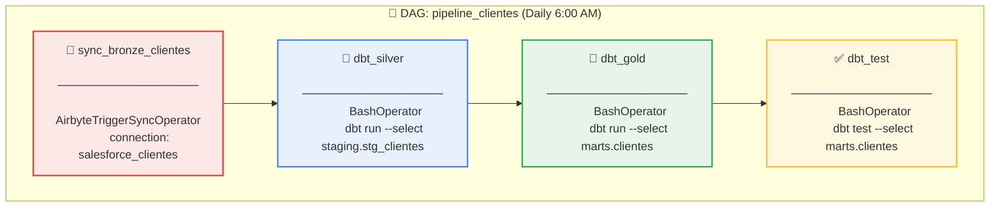
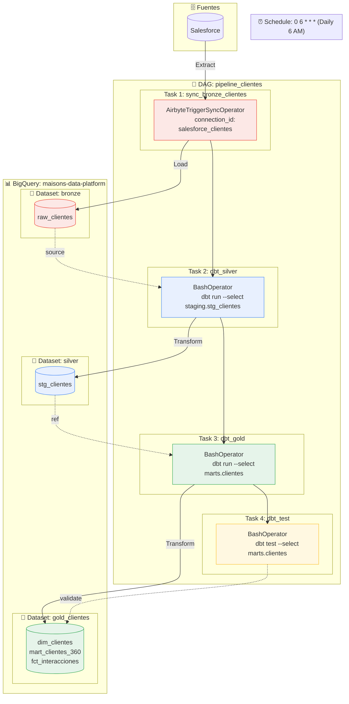
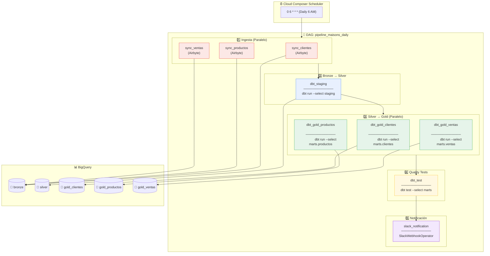

# DAG Pipeline Maisons - Diagramas y Documentación

## Índice

1. [Diagrama Simple - Pipeline de una Entidad](#1-diagrama-simple---pipeline-de-una-entidad)
2. [Diagrama Detallado - Con Capas y Destinos](#2-diagrama-detallado---con-capas-y-destinos)
3. [Diagrama Completo - Multi-entidad con Paralelismo](#3-diagrama-completo---multi-entidad-con-paralelismo)

---

## 1. Diagrama Simple - Pipeline de una Entidad

### Descripción

Este diagrama representa el flujo básico de un pipeline de datos para una **única entidad** (en este caso, `clientes`). Es el patrón fundamental que se replica para cada entidad del negocio. El pipeline se ejecuta de forma **secuencial**, donde cada tarea debe completarse exitosamente antes de que inicie la siguiente.

### Diagrama



### Descripción de Tareas

| # | Task ID | Operador | Acción | Origen → Destino |
|---|---------|----------|--------|------------------|
| 1 | `sync_bronze_clientes` | `AirbyteTriggerSyncOperator` | Extrae datos de Salesforce y los carga en BigQuery | Salesforce → `bronze.raw_clientes` |
| 2 | `dbt_silver` | `BashOperator` | Ejecuta modelos dbt de staging: limpieza, tipado, deduplicación | `bronze.raw_clientes` → `silver.stg_clientes` |
| 3 | `dbt_gold` | `BashOperator` | Ejecuta modelos dbt de marts: joins, agregaciones, KPIs | `silver.stg_clientes` → `gold_clientes.*` |
| 4 | `dbt_test` | `BashOperator` | Ejecuta tests de calidad sobre los marts generados | Valida `gold_clientes.*` |

### Acciones Detalladas por Tarea

#### Task 1: `sync_bronze_clientes`

```python
AirbyteTriggerSyncOperator(
    task_id='sync_bronze_clientes',
    connection_id='salesforce_clientes',  # ID de conexión en Airbyte
    asynchronous=False,                    # Espera a que termine el sync
    timeout=3600,                          # Timeout de 1 hora
)
```

**¿Qué hace?**
- Dispara un job de sincronización en Airbyte
- Airbyte conecta a Salesforce via API REST
- Extrae todos los registros nuevos/modificados desde el último sync (incremental)
- Carga los datos en formato raw a `bronze.raw_clientes`
- Incluye metadata: `_airbyte_extracted_at`, `_airbyte_raw_id`

---

#### Task 2: `dbt_silver`

```python
BashOperator(
    task_id='dbt_silver',
    bash_command='cd /dbt/maisons && dbt run --select staging.stg_clientes --target prod',
)
```

**¿Qué hace?**
- Ejecuta el modelo `stg_clientes.sql` en dbt
- Transforma datos de Bronze a Silver:
  - Renombra columnas a convención estándar
  - Aplica casting de tipos de datos
  - Elimina duplicados
  - Filtra registros inválidos
  - Agrega columnas calculadas básicas

**Modelo dbt ejemplo:**
```sql
-- models/staging/stg_clientes.sql
SELECT
    id AS cliente_id,
    TRIM(LOWER(email)) AS email,
    INITCAP(nombre) AS nombre,
    CAST(fecha_registro AS TIMESTAMP) AS fecha_registro,
    _airbyte_extracted_at AS loaded_at
FROM {{ source('bronze', 'raw_clientes') }}
WHERE id IS NOT NULL
QUALIFY ROW_NUMBER() OVER (PARTITION BY id ORDER BY _airbyte_extracted_at DESC) = 1
```

---

#### Task 3: `dbt_gold`

```python
BashOperator(
    task_id='dbt_gold',
    bash_command='cd /dbt/maisons && dbt run --select marts.clientes --target prod',
)
```

**¿Qué hace?**
- Ejecuta todos los modelos en `models/marts/clientes/`
- Crea dimensiones, facts y marts de negocio:
  - `dim_clientes`: Dimensión de clientes (SCD Type 2 si aplica)
  - `fct_interacciones`: Tabla de hechos con interacciones
  - `mart_clientes_360`: Vista consolidada del cliente

**Modelo dbt ejemplo:**
```sql
-- models/marts/clientes/mart_clientes_360.sql
SELECT
    c.cliente_id,
    c.nombre,
    c.email,
    c.fecha_registro,
    COUNT(DISTINCT v.venta_id) AS total_compras,
    SUM(v.monto) AS total_gastado,
    MAX(v.fecha) AS ultima_compra,
    CASE 
        WHEN SUM(v.monto) > 10000 THEN 'premium'
        WHEN SUM(v.monto) > 1000 THEN 'standard'
        ELSE 'basic'
    END AS segmento
FROM {{ ref('stg_clientes') }} c
LEFT JOIN {{ ref('stg_ventas') }} v ON c.cliente_id = v.cliente_id
GROUP BY 1, 2, 3, 4
```

---

#### Task 4: `dbt_test`

```python
BashOperator(
    task_id='dbt_test',
    bash_command='cd /dbt/maisons && dbt test --select marts.clientes --target prod',
)
```

**¿Qué hace?**
- Ejecuta todos los tests definidos para los marts de clientes
- Valida integridad y calidad de datos
- Si algún test falla, la tarea falla y se dispara alerta

**Tests ejemplo:**
```yaml
# models/marts/clientes/_clientes__models.yml
models:
  - name: mart_clientes_360
    columns:
      - name: cliente_id
        tests:
          - not_null
          - unique
      - name: segmento
        tests:
          - accepted_values:
              values: ['premium', 'standard', 'basic']
      - name: total_gastado
        tests:
          - dbt_utils.expression_is_true:
              expression: ">= 0"
```

---

## 2. Diagrama Detallado - Con Capas y Destinos

### Descripción

Este diagrama expande el anterior mostrando **explícitamente las capas de datos** (Bronze, Silver, Gold) y cómo cada tarea del DAG interactúa con los datasets de BigQuery. Es útil para entender el flujo de datos end-to-end y las dependencias entre capas.

### Diagrama



### Flujo de Datos por Capa

| Capa | Dataset | Tablas | Propósito | Retención |
|------|---------|--------|-----------|-----------|
| **🥉 Bronze** | `bronze` | `raw_clientes` | Datos crudos, inmutables, auditoría | 2+ años |
| **🥈 Silver** | `silver` | `stg_clientes` | Datos limpios, conformados | 1 año |
| **🥇 Gold** | `gold_clientes` | `dim_*`, `fct_*`, `mart_*` | Marts de negocio listos para consumo | Indefinido |

### Interacciones con BigQuery

| Paso | Operación SQL | Descripción |
|------|---------------|-------------|
| 1 | `INSERT INTO bronze.raw_clientes` | Airbyte inserta registros nuevos |
| 2 | `CREATE OR REPLACE TABLE silver.stg_clientes AS SELECT...` | dbt materializa tabla limpia |
| 3 | `CREATE OR REPLACE TABLE gold_clientes.mart_clientes_360 AS SELECT...` | dbt materializa mart |
| 4 | `SELECT COUNT(*) WHERE condicion_test` | dbt ejecuta queries de validación |

---

## 3. Diagrama Completo - Multi-entidad con Paralelismo

### Descripción

Este diagrama representa el **pipeline de producción real** que procesa múltiples entidades en paralelo. Optimiza el tiempo de ejecución aprovechando que las ingestas y los marts de diferentes entidades son independientes entre sí. Incluye también la notificación final al equipo.

### Diagrama



### Descripción de Fases

#### Fase 1️⃣: Ingesta (Paralelo)

| Task ID | Operador | Fuente | Destino | Tiempo Estimado |
|---------|----------|--------|---------|-----------------|
| `sync_clientes` | `AirbyteTriggerSyncOperator` | Salesforce | `bronze.raw_clientes` | ~10 min |
| `sync_productos` | `AirbyteTriggerSyncOperator` | SAP | `bronze.raw_productos` | ~15 min |
| `sync_ventas` | `AirbyteTriggerSyncOperator` | PostgreSQL | `bronze.raw_ventas` | ~20 min |

**Características:**
- Se ejecutan en **paralelo** (no hay dependencia entre ellas)
- El tiempo total es el de la tarea más larga (~20 min)
- Si una falla, las otras continúan (fail-fast opcional)

---

#### Fase 2️⃣: Bronze → Silver

| Task ID | Comando | Modelos Ejecutados | Tiempo Estimado |
|---------|---------|-------------------|-----------------|
| `dbt_staging` | `dbt run --select staging` | `stg_clientes`, `stg_productos`, `stg_ventas`, `stg_surveys` | ~5 min |

**Características:**
- Se ejecuta **después** de que TODAS las ingestas terminan
- Procesa todas las entidades en un solo comando dbt
- dbt optimiza el orden de ejecución según dependencias

**Transformaciones por modelo:**

| Modelo | Transformaciones |
|--------|-----------------|
| `stg_clientes` | Normalización email, deduplicación por ID |
| `stg_productos` | Parsing de categorías, conversión de moneda |
| `stg_ventas` | Join con calendario, cálculo de métricas |

---

#### Fase 3️⃣: Silver → Gold (Paralelo)

| Task ID | Comando | Dataset Destino | Tablas Creadas |
|---------|---------|-----------------|----------------|
| `dbt_gold_clientes` | `dbt run --select marts.clientes` | `gold_clientes` | `dim_clientes`, `mart_clientes_360`, `fct_interacciones` |
| `dbt_gold_productos` | `dbt run --select marts.productos` | `gold_productos` | `dim_productos`, `mart_catalogo`, `fct_inventario` |
| `dbt_gold_ventas` | `dbt run --select marts.ventas` | `gold_ventas` | `fct_transacciones`, `agg_ventas_diarias`, `mart_performance` |

**Características:**
- Se ejecutan en **paralelo** (independientes entre sí)
- Cada una escribe a un dataset Gold diferente
- Si hay dependencias cross-domain, se resuelven con `ref()` y dbt las ordena

---

#### Fase 4️⃣: Quality Tests

| Task ID | Comando | Tests Ejecutados |
|---------|---------|------------------|
| `dbt_test` | `dbt test --select marts` | ~50+ tests (unique, not_null, accepted_values, custom) |

**Tipos de tests:**

| Tipo | Ejemplo | Acción si Falla |
|------|---------|-----------------|
| `not_null` | `cliente_id IS NOT NULL` | Falla el DAG, no se envía notificación de éxito |
| `unique` | `COUNT(DISTINCT cliente_id) = COUNT(*)` | Falla el DAG |
| `accepted_values` | `segmento IN ('premium', 'standard', 'basic')` | Falla el DAG |
| `relationships` | FK existe en tabla referenciada | Warning (configurable) |

---

#### Fase 5️⃣: Notificación

| Task ID | Operador | Canal | Mensaje |
|---------|----------|-------|---------|
| `slack_notification` | `SlackWebhookOperator` | `#data-alerts` | Resumen de ejecución |

**Ejemplo de mensaje:**
```
✅ Pipeline Maisons Daily - SUCCESS
━━━━━━━━━━━━━━━━━━━━━━━━━━━
📅 Fecha: 2024-12-24 06:45:00 UTC
⏱️ Duración: 32 minutos
📊 Registros procesados:
   • Clientes: 15,234 (+127 nuevos)
   • Productos: 8,456 (+23 nuevos)
   • Ventas: 45,678 (+1,234 nuevas)
✅ Tests: 52/52 passed
🔗 Airflow: [Ver DAG Run]
```

---

### Código Python del DAG Completo

```python
from datetime import datetime, timedelta
from airflow import DAG
from airflow.operators.bash import BashOperator
from airflow.providers.airbyte.operators.airbyte import AirbyteTriggerSyncOperator
from airflow.providers.slack.operators.slack_webhook import SlackWebhookOperator

default_args = {
    'owner': 'data-team',
    'depends_on_past': False,
    'email_on_failure': True,
    'email': ['data-alerts@empresa.com'],
    'retries': 2,
    'retry_delay': timedelta(minutes=5),
}

with DAG(
    dag_id='pipeline_maisons_daily',
    default_args=default_args,
    description='Pipeline diario de datos para dominio Maisons',
    schedule_interval='0 6 * * *',  # Todos los días a las 6 AM UTC
    start_date=datetime(2024, 1, 1),
    catchup=False,
    tags=['maisons', 'production', 'daily'],
) as dag:

    # ═══════════════════════════════════════════════════════════
    # FASE 1: INGESTA (PARALELO)
    # ═══════════════════════════════════════════════════════════
    
    sync_clientes = AirbyteTriggerSyncOperator(
        task_id='sync_clientes',
        connection_id='salesforce_clientes',
        asynchronous=False,
        timeout=3600,
    )
    
    sync_productos = AirbyteTriggerSyncOperator(
        task_id='sync_productos',
        connection_id='sap_productos',
        asynchronous=False,
        timeout=3600,
    )
    
    sync_ventas = AirbyteTriggerSyncOperator(
        task_id='sync_ventas',
        connection_id='postgres_ventas',
        asynchronous=False,
        timeout=3600,
    )

    # ═══════════════════════════════════════════════════════════
    # FASE 2: BRONZE → SILVER
    # ═══════════════════════════════════════════════════════════
    
    dbt_staging = BashOperator(
        task_id='dbt_staging',
        bash_command='''
            cd /dbt/maisons && \
            dbt run --select staging --target prod --profiles-dir /dbt/profiles
        ''',
    )

    # ═══════════════════════════════════════════════════════════
    # FASE 3: SILVER → GOLD (PARALELO)
    # ═══════════════════════════════════════════════════════════
    
    dbt_gold_clientes = BashOperator(
        task_id='dbt_gold_clientes',
        bash_command='''
            cd /dbt/maisons && \
            dbt run --select marts.clientes --target prod --profiles-dir /dbt/profiles
        ''',
    )
    
    dbt_gold_productos = BashOperator(
        task_id='dbt_gold_productos',
        bash_command='''
            cd /dbt/maisons && \
            dbt run --select marts.productos --target prod --profiles-dir /dbt/profiles
        ''',
    )
    
    dbt_gold_ventas = BashOperator(
        task_id='dbt_gold_ventas',
        bash_command='''
            cd /dbt/maisons && \
            dbt run --select marts.ventas --target prod --profiles-dir /dbt/profiles
        ''',
    )

    # ═══════════════════════════════════════════════════════════
    # FASE 4: TESTS DE CALIDAD
    # ═══════════════════════════════════════════════════════════
    
    dbt_test = BashOperator(
        task_id='dbt_test',
        bash_command='''
            cd /dbt/maisons && \
            dbt test --select marts --target prod --profiles-dir /dbt/profiles
        ''',
    )

    # ═══════════════════════════════════════════════════════════
    # FASE 5: NOTIFICACIÓN
    # ═══════════════════════════════════════════════════════════
    
    slack_notification = SlackWebhookOperator(
        task_id='slack_notification',
        webhook_token='{{ var.value.slack_webhook_token }}',
        message='''
            :white_check_mark: *Pipeline Maisons Daily - SUCCESS*
            :calendar: Fecha: {{ ds }}
            :stopwatch: Duración: {{ task_instance.xcom_pull(task_ids='dbt_test', key='duration') }}
            :link: <{{ task_instance.log_url }}|Ver logs en Airflow>
        ''',
        channel='#data-alerts',
    )

    # ═══════════════════════════════════════════════════════════
    # DEPENDENCIAS
    # ═══════════════════════════════════════════════════════════
    
    # Fase 1 (paralelo) → Fase 2
    [sync_clientes, sync_productos, sync_ventas] >> dbt_staging
    
    # Fase 2 → Fase 3 (paralelo)
    dbt_staging >> [dbt_gold_clientes, dbt_gold_productos, dbt_gold_ventas]
    
    # Fase 3 (paralelo) → Fase 4
    [dbt_gold_clientes, dbt_gold_productos, dbt_gold_ventas] >> dbt_test
    
    # Fase 4 → Fase 5
    dbt_test >> slack_notification
```

---

## Leyenda de Colores

| Color | Fase | Descripción |
|-------|------|-------------|
| 🔴 Rojo | Ingesta | Airbyte sync: Fuentes → Bronze |
| 🔵 Azul | Staging | dbt run: Bronze → Silver |
| 🟢 Verde | Marts | dbt run: Silver → Gold |
| 🟡 Amarillo | Tests | dbt test: Validación de calidad |
| 🟣 Púrpura | Notificación | Slack/PagerDuty alert |

---

## Timeline de Ejecución Típico

```
06:00 ─┬─ sync_clientes (10 min)
       ├─ sync_productos (15 min)
       └─ sync_ventas (20 min)
06:20 ─── dbt_staging (5 min)
06:25 ─┬─ dbt_gold_clientes (8 min)
       ├─ dbt_gold_productos (6 min)
       └─ dbt_gold_ventas (10 min)
06:35 ─── dbt_test (5 min)
06:40 ─── slack_notification (instant)
━━━━━━━━━━━━━━━━━━━━━━━━━━━━━━━━━━
TOTAL: ~40 minutos
SLA: Datos en Gold antes de 08:00 AM ✅
```

---

## Manejo de Errores

| Escenario | Comportamiento | Acción |
|-----------|----------------|--------|
| Fallo en ingesta | Retry automático (2x) | Si persiste, alerta y DAG falla |
| Fallo en dbt run | Retry automático (2x) | Revisar logs, posible schema change |
| Fallo en dbt test | DAG falla, no notifica éxito | Revisar calidad de datos en fuente |
| Timeout | Task falla después de 1h | Optimizar query o aumentar recursos |
